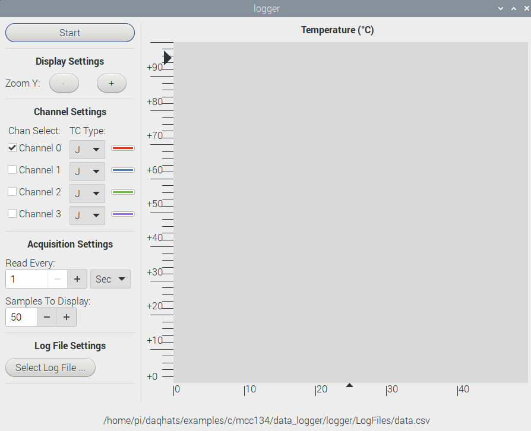

# IFS Tribology Lab Raspberry Pi Data Logger

Information about setting up and using Raspberry Pi Data Loggers in the Tribology lab.

## Overview

The data logger can be used with the following machines.

* Pendulum Tribometer.
* 4 Ball Machine.
* (Others coming soon).

Each data logger contains a Raspberry Pi 4B with the following connectors:

* 2 x BNC connectors for +/-10V voltage inputs.  These are connected to either a MCC-118 (12 bit) or a MCC-118 (16 bit) data acquisition (DAQ) hat.
* 2 x K type thermocouple inputs.  These are connected to a MCC-134 thermocouple data acquisition (DAQ) hat.

In addition, the data logger used for the pendulum tribometer has a 9 way D-Sub connector that is connected to the rotary encoder.

Data sheets for the DAQ hats and for the rotary encoder can be found in the docs directory of this repo.

## Using the data loggers

__IMPORTANT__ To prevent hackers mis-using the Raspberry Pi, __the data loggers are not
connected to the internet__.

This means that the date and time are nearly always wrong as the Raspberry Pi normally updates the date and time from the internet.

At the beginning of each test run, it is a good idea to record the time shown on the data logger in your log book or similar so that you know when each test run was done and what time the data logger was showing.

You will also need to get the data off the data logger manually.  To do this, you need to plugin a USB memory stick (please use your own) and copy the files using the file manager or command line on to the memory stick.

### Thermocouple software

The MCC DAQ hats software has a nice data logger utility for the thermocouple hat.  To run it:

```bash
cd ~/daqhats/examples/c/mcc134/data_logger/logger/
./logger
```

A nice looking program starts up.



Channels 0 and 1 are connected to the 2 green thermocouple connectors on the data logger box.

* Select the channel that you want to use.
* Set the `TC Type` to `K`.
* Adjust the `Acquisition Settings` as required.
* Select the log file to write to.  The name of the default file is shown at the bottom of the app, `.../dada.csv`.
* When you are ready to start recording, press `Start`.  The most recent data will be shown on the graph on the app and all the data will be written to the chosen `.csv` file.
* Press the `Stop` button when done (the start button changes to a stop button).

### Pendulum Tribometer software

The Pendulum Tribometer software records the following information:

* The speed of the test rotor in RPM.
* The voltage sent from the charge amplifier.
* The angle of the test arm from 0, calculated from the input voltage.
* The coefficient of friction, calculated from the angle.

These data are output into a CSV file for later analysis. To run the software, type the following commands in a terminal window.

```bash
cd ~/ifs-tribology-raspberry-pi/code
./start.bash
```

These commands will start two programs.  The first program is `logger.py`
that logs data from the pendulum tribometer to a CSV file.  The second
program is a graph plotting program `plotter.py`.  This program is only
intended to allow you to see roughly what is going on and
__THE GRAPHS ARE NOT STORED__.

The default name of the CSV file is "data.csv" but you can change
this as follows:

```bash
 ./start.bash my_file_name.csv
```

In this example, the data will be written to the file `my_file_name.csv`.

If you use the same data file name more than once, the previous
data file will be deleted and a new file will be written to.

To plot a graph of the data, you need to copy the CSV files that the logger
program creates onto a USB memory stick and then use Excel or similar
to create the plots that you need.

## Maintainer notes

There are some notes and photos on how the hardware is put together [here](construction/construction.md).

There are some notes on testing the final boxes [here](testing.md).

I also wrote some [design notes](design.md) for the software.

## License

This work is licensed under the MIT licence.  See LICENSE file for details.

© 2023-2025, University of Leeds.

The author, A. Blight, has asserted his moral rights.
