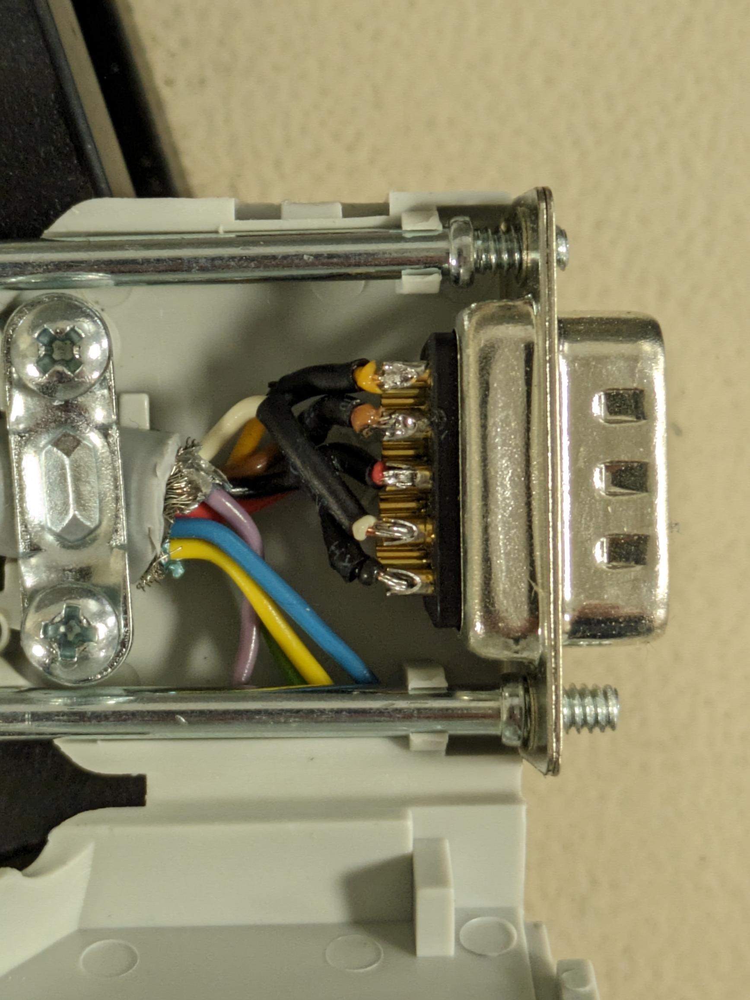
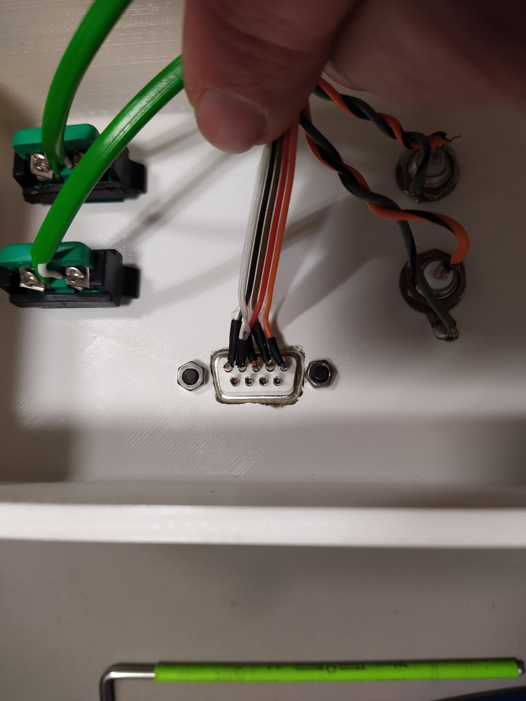
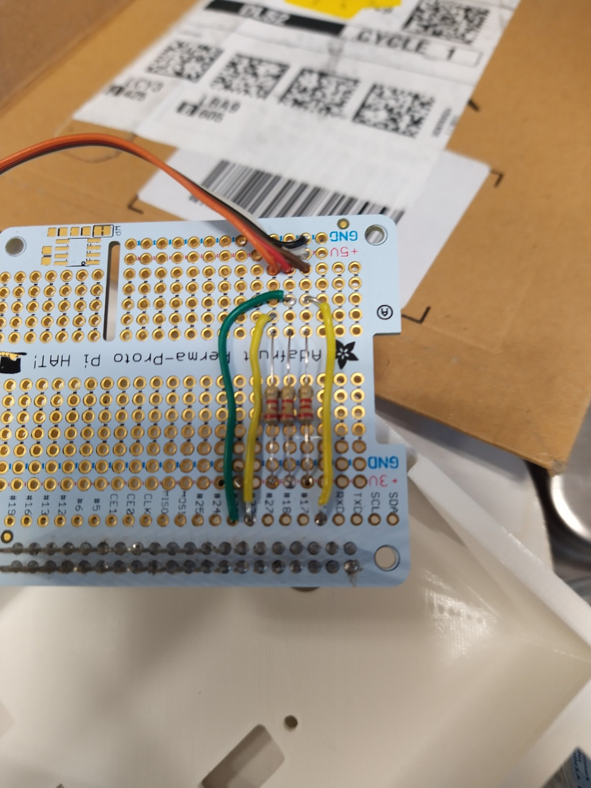

# Construction

## BOM

Per unit

* 1 x 3D printed case.  Custom design.
* 2 x BNC sockets, chassis mount. <https://uk.rs-online.com/web/p/coaxial-adapters/5464083>
* 2 x K type thermocouple sockets. <https://uk.rs-online.com/web/p/sensor-accessories/4559742>
adafruit-perma-proto-hat-for-pi-mini-kit?variant=1038451613>
* 1 x MCC 118/128 DAQ HAT - <https://uk.rs-online.com/web/p/raspberry-pi-hats-add-ons/2306179?gb=b> or <https://uk.rs-online.com/web/p/raspberry-pi-hats-add-ons/2306180?gb=b>
* 1 x MCC134 DAQ HAT <https://uk.rs-online.com/web/p/raspberry-pi-hats-add-ons/2306181>
* 4 x Case screws M3 16mm (comes in a pack 100): <https://uk.farnell.com/tr-fastenings/m3-16-krstmc-z100/screw-pozi-csk-steel-bzp-m3x16/dp/1420400>
* 4 x Fan screws M2.5 12mm (comes in a pack 100): <https://uk.farnell.com/tr-fastenings/dm2-516prstmcz100din7985/screw-pan-head-pozi-steel-m2-5/dp/2506091>

Optional (when encoder fitted)

* 1 x 9 way D-Sub female chassis mount.  <https://uk.rs-online.com/web/p/D-Sub-connectors/7873852>
* 1 x Adafruit Perma-Proto board ADA2310 - <<https://shop.pimoroni.com/products/>

Additional parts (needed but not in single unit quantities)

* 1 box of stand offs - <https://www.amazon.co.uk/GeeekPi-Standoffs-Assortment-Box%EF%BC%8CMale-Female-Screwdriver/dp/B07PHBTTGV>
* 1 pack of 2 fans and heat sinks. - <https://www.amazon.co.uk/GeeekPi-Raspberry-30x30x7mm-Brushless-Retroflag/dp/B07FVQG926/>

NOTE: The fans have M2.5 15mm screws.  These are used to screw the base of the case to the Raspberry Pi assembly.  The M2.5 12mm screws are then used to hold the fans in place.

## Wiring of rotary encoder

The rotary encoder fitted to the pendulum tribometer is made by British Encoder
Products and has the following specifications:

* model 15/T/OC
* pulse per revolution (PPR) count of 1200
* Power supply voltage: 5 to 24V

The rotary encoder outputs that we use are:

A - Rotary encoder position A - 1200 pulses per revolution.
B - Rotary encoder position B - 1200 pulses per revolution.
Z - Rotary encoder index - one pulse per revolution.

As the outputs from the encoder are open collector, 2k2 pull up resistors connected to the 3V3 rail have been added to the proto-board for each GPIO input.

A 9 way D-Sub connector is used to connect the encoder to the data logger.  The pins are allocated in the table below.

| GPIO Pin | D-Sub Pin | Encoder Colours | Encoder names |
|---|---|---|---|
| Ground | 1 | Black  | Ground |
| 5V     | 2 | White  | VCC |
| GPIO23 | 3 | Brown  | B |
| GPIO04 | 4 | Red    | A |
| GPIO22 | 5 | Orange | Z |

```text
   -------------
   \ 5 4 3 2 1 /
    \ 9 8 7 6 /
     ---------
```

The 9 way D-Sub connector pin number when viewed from outside of case.






